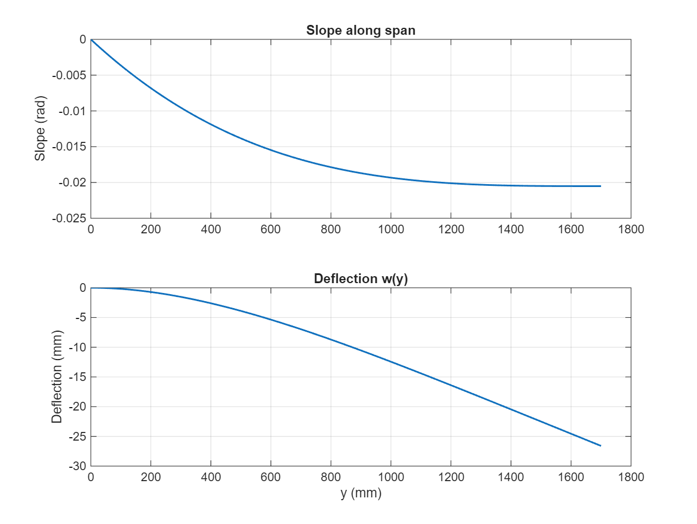

# Wing Aero-Structural Model (MATLAB)

A modular MATLAB pipeline for **aerodynamic and structural analysis of finite wings** using classical methods.
Starting from 2D airfoil data, the model applies finite-wing corrections, estimates spanwise loading, computes shear and bending, predicts deflection and compare with FEA results from Static Structural (Ansys), and links results to mission performance via the Breguet range and endurance (propeller aircraft).

If you are new, begin with the **Quick Start** section.

---

## Quick Start

### Requirements

* MATLAB R2020b or newer (Base MATLAB is sufficient; no toolboxes required)
* Works on Windows, macOS, or Linux

### Setup

1. Clone the repository and open it in MATLAB.
2. Ensure the input Excel file `Function/Aero_Coeff_2D.xlsx` is available (or update the path).

   * Columns expected: `alpha_deg`, `CL_2D`, `CD_2D` (optional `CM_2D`)
   * Angles in degrees; coefficients dimensionless
3. Open `Function/Main_Code.m` and adjust the **User Input** block (atmosphere, geometry, AOA sweep, discretization, materials, etc.) to your case.

### Run

Execute `Function/Main_Code.m`. The script will:

* Compute wing parameters
* Convert 2D to 3D aerodynamics
* Estimate spanwise lift with Schrenk’s method
* Integrate sectional lift/pressure
* Build shear force and bending moment diagrams (SFD/BMD)
* Compute deflection
* Estimate range and endurance

### Outputs

* 3D Finite Wing CL/CD and L/D vs. angle of attack
* Spanwise lift and pressure distributions
* SFD and BMD plots
* Deflected shape, tip deflection, and slope
* Breguet range and endurance
  
## Sample Plots

Below are representative outputs from the model:

### Aerodynamic Results
  


### Spanwise Distributions
  
  


### Structural Analysis
  
.jpg)  


For more details, see [Function/Function\_Explanation.md](Function/Function_Explanation.md).

---

## Repository Structure

```
Wing_Aero_Structural_Model/
│── Function/
│   ├── Main_Code.m              % Main driver script
│   ├── Wing_Parameter_Calculation.m
│   ├── aerodynamic_coeff.m
│   ├── schrenk_dist.m
│   ├── sec_lift_pressure.m
│   ├── over_the_section.m
│   ├── SFD_BMD.m / SFD_BMD2.m
│   ├── Deflection.m
│   ├── Range_Endurance.m
│   ├── Plots_Aero_coeff.m
│   ├── Aero_Coeff_2D.xlsx       % Input airfoil data
│   └── Function_Explanation.md  % Extended documentation
│── LICENSE
│── README.md
```

---

## Function Overview (Detailed)

**Units convention**

- Length: meters (m)  
- Mass: kilograms (kg)  
- Force/Weight: newtons (N)  
- Velocity: m/s  
- Density: kg/m³  
- Angle: degrees (unless otherwise noted)  

| Function                     | Purpose / Description                                | Key Inputs (units)                                                                 | Key Outputs (units)                                      |
| ---------------------------- | --------------------------------------------------- | ---------------------------------------------------------------------------------- | -------------------------------------------------------- |
| `Wing_Parameter_Calculation` | Compute geometry and flow parameters                 | ρ [kg/m³], V∞ [m/s], μ [Pa·s], g [m/s²], c_root [m], c_tip [m], b_half [m]         | Span b [m], Wing area S [m²], Aspect ratio AR [-], Taper λ [-], MAC [m], Reynolds Re [-], Dynamic pressure q∞ [Pa], Oswald factor e [-] |
| `aerodynamic_coeff`          | Convert 2D polars → finite-wing aerodynamics, drag polar | CL₂D(α), CD₂D(α) (from Excel), AR [-], e [-], α_sweep [deg]                        | 3D lift slope a₃ᴰ [1/rad], Zero-lift α₀L [deg], CL₃ᴰ(α), CD(α) incl. induced, L/D(α) |
| `schrenk_dist`               | Approximate spanwise lift using Schrenk’s method     | Planform chord c(y), total CL, span b [m]                                          | Chord distributions (planform, elliptical, Schrenk), q_lift(y) [N/m] |
| `sec_lift_pressure`          | Discretize span and compute sectional lift/pressure  | N_sections [-], q∞ [Pa], c(y) [m], CL(y) or q_lift(y) [N/m]                        | Section lift Lᵢ [N], sectional pressure pᵢ [Pa], y-stations [m] |
| `over_the_section`           | Pressure distribution along chord/section            | Section geometry, local α [deg], q∞ [Pa]                                           | p(x,y) distribution (absolute/normalized), sectional L/D |
| `SFD_BMD` / `SFD_BMD2`       | Shear force and bending moment analysis              | Distributed lift q_lift(y) [N/m], point loads (N) at y [m], support locations       | Shear force V(y) [N], Bending moment M(y) [N·m], root shear [N], root moment [N·m] |
| `Deflection`                 | Beam deflection under bending (Euler–Bernoulli)      | M(y) [N·m], Elastic modulus E [Pa], Moment of inertia I(y) [m⁴], boundary conditions | Deflection w(y) [m], slope θ(y) [rad], tip deflection [m] |
| `Range_Endurance`            | Breguet endurance and range (prop aircraft)          | ηₚ [-], Specific fuel consumption c [1/s or 1/hr], L/D [-], Weight ratio Wᵢ/Wf [-] | Endurance E [s or hr], Range R [m or km] |
| `Plots_Aero_coeff`           | Helper for visualizing aerodynamic performance       | Data structures from `aerodynamic_coeff`                                           | Figures: CL–α, CD–CL, L/D–α curves |

---
The function [`sec_lift_pressure.m`](Function/sec_lift_pressure.m) generates spanwise sectional lift and pressure distributions section wise produces both numerical tables and visualizations which can be fitted into Static Structural to see the deflection and match with the value from beam deflection theory.


--- 

## Key Equations

**Finite-wing lift slope**
$a_{3D} = \frac{a_{2D}}{1 + \dfrac{a_{2D}}{\pi e\, AR}}$

**Induced drag**
$C_{D,i} = \frac{C_L^2}{\pi e\, AR}$

**Total drag polar**
$C_D \approx C_{D0} + \frac{1}{\pi e AR} C_L^2$

**Schrenk’s method**
$q_{\text{Schrenk}}(y) \approx \tfrac{1}{2}[q_{\text{planform}}(y) + q_{\text{elliptic}}(y)]$

**Shear and bending (Euler–Bernoulli)**
$\frac{dV}{dy} = -w(y), \quad \frac{dM}{dy} = V(y)$

**Deflection**
$E I(y)\, \frac{d^2 w}{dy^2} = M(y)$

**Breguet (prop aircraft)**

* Endurance:
  $E = \frac{\eta_p}{c}\, \ln\!\left(\frac{W_i}{W_f}\right)$
* Range:
  $R = \frac{\eta_p}{c}\, \frac{L}{D}\, \ln\!\left(\frac{W_i}{W_f}\right)$


---

## Assumptions & Limitations

* Incompressible, low-subsonic flow (no compressibility effects)
* Unswept, untwisted, tapered wings
* Linear CL–α region (no stall modeling)
* Quasi-steady aerodynamics only
* Structures: Euler–Bernoulli beam (bending only; no torsion or aeroelasticity)
* Point loads treated as concentrated forces

---

## Validation

* Compare CL–α and CD with AVL/XFOIL + lifting-line theory or Visit [Airfoil Tools](http://airfoiltools.com/search/index)
* Cross-check root bending moment with hand integration of q(y)
* Verify tip deflection with closed-form beam theory (uniform load, constant EI) or Compare with FEA analysis 

---

## References

* Anderson, J. D. *Fundamentals of Aerodynamics*, McGraw-Hill
* Raymer, D. P. *Aircraft Design: A Conceptual Approach*, AIAA
* Etkin, B. *Dynamics of Flight*, Wiley
* McCormick, B. W. *Aerodynamics, Aeronautics, and Flight Mechanics*, Wiley

---

## License & Citation

This project is licensed under the [MIT License](LICENSE).
If used in reports or projects, please cite this repository.

